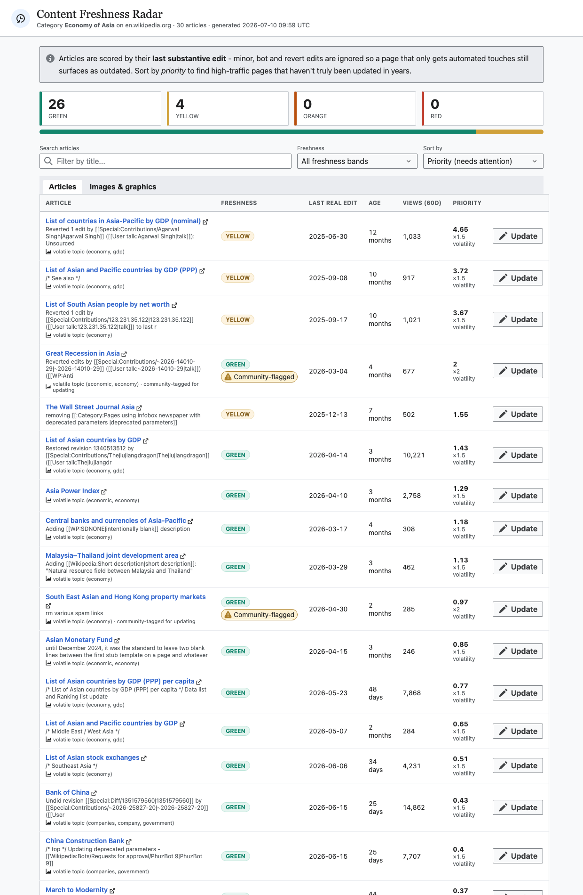

# Content Freshness Radar

Identify and flag outdated Wikipedia articles, obsolete screenshots, and stale
graphics — and give the community a one-click path to update them.

See [`PLAN.md`](PLAN.md) for the full design. This repo is a working end-to-end
implementation: a Python pipeline that scores content freshness from the live
MediaWiki API, and a dashboard built with the **[Codex](https://doc.wikimedia.org/codex/main/)**
Wikimedia design system so it looks and feels native to the wiki ecosystem.



## What it does

- **Freshness color-coding** — every article gets a GREEN / YELLOW / ORANGE / RED
  band based on its *last substantive edit* (minor, bot and revert edits are
  ignored, so a page that only gets automated touches still surfaces as stale).
- **Outdated-article ranking** — a priority score combines staleness with
  pageviews **and topic volatility**, so high-traffic, fast-decaying pages that
  haven't truly been updated in years rise to the top.
- **Volatility weighting** — content that goes stale fast (elections, economies,
  demographics, software) and pages with `{{As of|YYYY}}` "dated statements" or
  maintenance tags are boosted; stable topics (math, history) are not. The
  dashboard shows *why* each page was flagged and, when present, the year its
  data is marked "as of" (e.g. a statistic still "as of 2012").
- **Outdated images/graphics** — images used on the pages are scored by how long
  since they were last re-uploaded, and classified as screenshot / graphic.
- **Contribution nudges** — every row has an "Update" button that deep-links to
  the wiki editor; stale pages get a suggested `{{Update}}` template.

## Requirements

- **Python 3** (standard library only — no pip install needed) for the pipeline.
- A **web browser** for the dashboard (no Node/npm build step; Codex + Vue are
  vendored in `webapp/vendor/` and loaded via an ES-module import map).

## 1. Generate data

```bash
# Score a category and everything in its subcategories (a whole topic tree)
python3 run_pipeline.py --category "Economy of Asia" --recursive --depth 2 --limit 30 --images

# Score just the pages directly in one category
python3 run_pipeline.py --category "Economy of Oceania" --limit 25 --images

# Other examples
python3 run_pipeline.py --category "Elections in India" --recursive --limit 50
python3 run_pipeline.py --category "Windows 10" --limit 30 --images
```

This writes `webapp/data.json`. Flags:

| Flag | Default | Meaning |
|------|---------|---------|
| `--category` | (required) | Category to scan (no `Category:` prefix needed) |
| `--wiki` | `en.wikipedia.org` | Any MediaWiki host |
| `--limit` | `40` | Max articles to score |
| `--recursive` | off | Also walk subcategories (turns one category into a topic tree) |
| `--depth` | `2` | Subcategory depth when `--recursive` is set |
| `--images` | off | Also score images used on the pages |
| `--images-cap` | `60` | Max images to score |

## 2. View the dashboard

```bash
cd webapp
python3 -m http.server 8777
# then open http://localhost:8777
```

## 3. Score a single item (quick POC)

```bash
python3 poc.py --article "Demographics of Niue"
python3 poc.py --image "File:Tux.svg" --wiki commons.wikimedia.org
```

## Project layout

```
content-freshness-radar/
├── PLAN.md               # full design doc + MediaWiki schema mapping
├── poc.py                # single-article / single-image scorer
├── run_pipeline.py       # category -> webapp/data.json
├── cfr/
│   ├── mediawiki.py      # Action API + Pageviews REST client
│   ├── freshness.py      # substantive-edit detection + banding + priority
│   └── screenshots.py    # image freshness + screenshot/graphic classification
└── webapp/
    ├── index.html        # import-map entry (no build step)
    ├── app.js            # Vue 3 + Codex dashboard
    ├── style.css
    ├── data.json         # generated by the pipeline
    └── vendor/           # Codex, Codex icons, Vue (ES modules)
```

## Notes & limits

- Read-only: the tool never edits the wiki; it only routes editors to the editor.
- Bot detection in the POC is heuristic (username ends in "bot") plus revert
  tags; the replica-DB approach in `PLAN.md` §11 is more precise for scale.
- Volatility is inferred from categories (topic + hidden `{{As of}}` / maintenance
  categories). For full-wiki scale, do a cheap replica-DB staleness triage first,
  then enrich only the candidates via the API (see `PLAN.md` §11).
